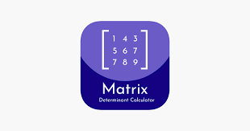

<a id="readme-top"></a>


<!-- PROJECT LOGO -->
<br />
<div align="center">
  

  <h1 align="center">DETERMINANT-FOUNDER</h1>
</div>

<details>
  <summary>Table of Contents</summary>
  <ol>
    <li>
      <a href="#about-the-project">About The Project</a>
      <ul>
        <li><a href="#key-features">Key Features</a></li>
        <li><a href="#built-with">Built With</a></li>
      </ul>
    </li>
    <li>
      <a href="#getting-started">Getting Started</a>
      <ul>
        <li><a href="#prerequisites">Prerequisites</a></li>
        <li><a href="#installation">Installation</a></li>
      </ul>
    </li>
    <li><a href="#license">License</a></li>
    <li><a href="#acknowledgments">Acknowledgments</a></li>
  </ol>
</details>

## About The Project

This project is a graphical user interface (GUI) application developed using Python's Tkinter library. It allows users to calculate the determinants of 2x2 and 3x3 matrices. The application provides a simple, intuitive interface for inputting matrix values and displays the calculated determinant.

### Key Features

- **User-Friendly Interface:**
  - The application utilizes Tkinter to create a clean and visually appealing interface.
  - Large, readable fonts and color schemes (yellow for input fields, maroon for buttons) enhance usability.

- **Matrix Determinant Calculation:**
  - Supports calculations for both 2x2 and 3x3 matrices.
  - Users can input matrix elements, and the determinant is calculated and displayed with a single click.

- **Error Handling:**
  - Built-in error handling ensures that invalid inputs are detected and handled gracefully, preventing application crashes.
  - Displays an "Invalid input" message if non-numeric values are entered.

- **Responsive Design:**
  - Grid layout with padding (`padx` and `pady`) ensures that the elements are well-spaced and easy to interact with.

- **Clear Result Display:**
  - Results are displayed prominently in a label below the input fields and calculation button.
  - Ensures users can easily see the calculated determinant.

## Built With

- [](https://www.python.org/)
- [](https://docs.python.org/3/library/tkinter.html)
- [](https://www.docker.com/)

## Getting Started

To get a local copy up and running, follow these steps.

### Prerequisites

- **Python**: Ensure you have the latest version of Python installed. [Python Installation Guide](https://www.python.org/downloads/)
- **Docker**: Ensure you have the latest version of Docker installed. [Docker Installation Guide](https://docs.docker.com/get-docker/)

### Installation

1. Clone the repo
   ```sh
   git clone https://github.com/krishujeniya/DETERMINANT-FOUNDER.git
   cd DETERMINANT-FOUNDER
   ```
2. Build the Docker image
   ```sh
   docker build -t determinant_founder .
   ```

3. Step-by-Step Guide to Enable X11 Forwarding in Docker

   **Install XQuartz (macOS) or Xming (Windows)**:
   - **macOS**: Install XQuartz from [XQuartz.org](https://www.xquartz.org/).
   - **Windows**: Install Xming from [Xming.org](https://sourceforge.net/projects/xming/).

   **Allow Connections**:
   - **macOS**: Open XQuartz, go to **Preferences > Security**, and check "Allow connections from network clients".
   - **Windows**: Start Xming with default settings.

   **Run Docker Container with X11 Forwarding**:

   **On Linux**:
   ```sh
   xhost +local:docker
   docker run -it --rm -e DISPLAY=$DISPLAY -v /tmp/.X11-unix:/tmp/.X11-unix determinant_founder
   ```

   **On macOS with XQuartz**:
   ```sh
   xhost + 127.0.0.1
   docker run -it --rm -e DISPLAY=host.docker.internal:0 determinant_founder
   ```

   **On Windows with Xming**:
   ```sh
   docker run -it --rm -e DISPLAY=host.docker.internal:0 determinant_founder
   ```

## License

Distributed under the MIT License. See `LICENSE.txt` for more information.

## Acknowledgments

* [Python](https://www.python.org/)
* [Tkinter](https://docs.python.org/3/library/tkinter.html)
* [Docker](https://www.docker.com/)
* [Open Source Community](https://opensource.org/)
* [Contributors](https://github.com/determinant_founder/my-tkinter-app/graphs/contributors)
